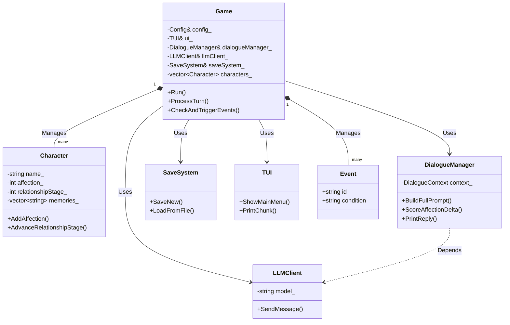

# AI Dating Simulator Project Report

이 문서는 프로젝트 발표 및 코드 리뷰를 위해 작성된 상세 보고서입니다. 본 프로젝트는 C++ 기반의 텍스트 기반 사용자 인터페이스(TUI)를 갖춘 AI 연애 시뮬레이션 게임입니다. LLM(Large Language Model)을 활용하여 캐릭터와 자유로운 대화가 가능하며, 호감도 시스템과 이벤트 시스템이 유기적으로 작동합니다.

## 1. 프로젝트 개요 (Project Overview)

*   **프로젝트명**: C_AI_Simulate (AIDatingSim)
*   **개발 언어**: C++ (C++17)
*   **플랫폼**: Windows (Console Application)
*   **핵심 기능**:
    *   LLM(OpenAI, Ollama) 연동을 통한 자연스러운 대화
    *   대화 내용에 따른 실시간 호감도 분석 및 변화
    *   호감도 단계에 따른 캐릭터 성격/행동 변화
    *   JSON 기반의 데이터 구조화 (캐릭터 설정, 이벤트, 세이브 파일)

## 2. 클래스 다이어그램 (Class Diagram)



## 3. 사용된 라이브러리 (Libraries Used)

이 프로젝트는 다음과 같은 외부 라이브러리 및 API를 사용했습니다:

1.  **nlohmann/json** (v3.11.3)
    *   **용도**: 데이터 직렬화 및 역직렬화.
    *   **사용처**: 세이브/로드 시스템(`SaveSystem`), LLM API 통신 시 JSON 파싱(`LLMClient`, `DialogueManager`), 캐릭터 및 이벤트 데이터 로드.
2.  **libcurl** (CURL)
    *   **용도**: HTTP 요청 처리.
    *   **사용처**: LLM API 서버(OpenAI 또는 Ollama)와 통신하여 메시지를 주고받는 네트워크 계층 구현.
3.  **openai.hpp / ollama.hpp** (Header-only wrappers)
    *   **용도**: 각 LLM 서비스에 간편하게 접근하기 위한 래퍼.
    *   **사용처**: `LLMClient` 클래스 내부에서 실제 API 호출 로직 담당.
4.  **Standard Library (STL)**
    *   `vector`, `string`, `unordered_map`, `map`: 데이터 관리.
    *   `iostream`, `fstream`: 파일 입출력 및 콘솔 IO.

## 4. LLM 작동 매커니즘 (LLM Mechanism)

이 프로젝트의 핵심인 자유로운 대화는 LLM(Large Language Model)과의 실시간 통신을 통해 이루어집니다.
소스 코드는 `src` 디렉토리에 위치하며, 데이터 파일은 `data` 디렉토리에서 관리됩니다.

### 3.1 소스 코드 (`src/`)

| 파일명 | 설명 |
| :--- | :--- |
| **`main.cpp`** | 프로그램의 진입점(Entry Point). 설정 로드 및 게임 루프 시작. |
| **`Game.cpp/h`** | **핵심 엔진**. 게임 루프(`Run`), 사용자 입력 처리(`ProcessTurn`), 이벤트 체킹 및 트리거(`CheckAndTriggerEvents`) 등을 총괄. |
| **`Character.cpp/h`** | **캐릭터 모델**. 이름, 호감도(`Affection`), 관계 단계(`RelationshipStage`), 플래그 등을 관리. |
| **`DialogueManager.cpp/h`** | **대화 관리자**. 대화 컨텍스트(History) 유지, 프롬프트 생성(`BuildFullPrompt`), 호감도 점수 계산(`ScoreAffectionDelta`) 담당. |
| **`LLMClient.cpp/h`** | **API 클라이언트**. 외부 LLM 서비스(OpenAI/Ollama)와의 통신을 추상화하여 메시지 전송 및 응답 수신. |
| **`SaveSystem.cpp/h`** | **저장 시스템**. 현재 게임 상태(캐릭터 상태, 대화 내역)를 JSON 파일로 저장하거나 로드. |
| **`TUI.cpp/h`** | **UI 시스템**. 메뉴 출력(`ShowMainMenu`), 타이핑 효과 텍스트 출력, 화면 클리어 등 사용자 입출력 담당. |
| **`Event.h`** | 이벤트 데이터 구조체 정의 (조건, 대사 등). |
| **`Config.h`** | 게임 설정 클래스 정의. |
| **`JsonHelper.h`** | JSON 처리 시 유용한 헬퍼 함수 모음. |

### 3.2 데이터 (`data/`)

*   `characters/`: 캐릭터별 초기 설정 및 프롬프트 템플릿 파일이 위치합니다.
*   `events/`: JSON 형식으로 정의된 게임 이벤트 파일들이 위치합니다.

## 6. 핵심 구현 함수 상세 (Key Functions)

주요 클래스별 핵심 함수에 대한 설명입니다.

### Game 클래스 (`Game.h`)
*   **`Run()`**: 게임의 메인 루프를 실행합니다. 사용자가 종료하기 전까지 입력을 대기하고 처리합니다.
*   **`ProcessTurn(userInput)`**: 사용자의 입력을 받아 대화 매니저를 통해 LLM에 전달하고, 응답을 처리합니다.
*   **`CheckAndTriggerEvents()`**: 현재 호감도나 플래그 상태를 확인하여 조건에 맞는 이벤트가 있는지 검사하고 실행합니다.
*   **`LoadEvents(filePath)`**: 외부 JSON 파일에서 이벤트 목록을 불러옵니다.

### Character 클래스 (`Character.h`)
*   **`AddAffection(delta)`**: 호감도를 증감시킵니다. 범위는 0~100으로 자동 제한(Clamping)됩니다.
*   **`AdvanceRelationshipStage()`**: 호감도가 특정 임계치를 넘으면 관계 단계(서먹함 -> 친함 -> 연인 등)를 상승시킵니다.
*   **`SetFlag(flag, value)` / `GetFlag(flag)`**: 스토리 진행 상황을 불리언 플래그로 저장하고 조회합니다.

### DialogueManager 클래스 (`DialogueManager.h`)
*   **`BuildFullPrompt(character, user, input)`**: 시스템 설정, 캐릭터 페르소나, 대화 히스토리, 현재 사용자 입력을 모두 합쳐 LLM에 보낼 최종 JSON 프롬프트를 생성합니다.
*   **`ScoreAffectionDelta(userText, npcText)`**: (구현 방식에 따라 다름) 대화의 뉘앙스나 키워드를 분석하여 호감도 변화량을 결정합니다.
*   **`PrintReply(client, messages)`**: LLM으로부터 응답을 받아 TUI를 통해 **타이핑 효과**(Typing Effect)와 함께 출력합니다.

### SaveSystem 클래스 (`SaveSystem.h`)
*   **`SaveNew(character, context)`**: 현재 캐릭터 상태와 대화 맥락을 JSON 객체로 변환하여 파일(`saves/`)로 씁니다.
*   **`LoadFromFile(filename, ...)`**: 저장된 JSON 파일을 읽어 게임 상태를 복원합니다.

## 7. 빌드 및 실행 방법 (Build & Run)

이 프로젝트는 CMake를 사용하여 빌드합니다.

```bash
# 빌드 디렉토리 생성
mkdir build
cd build

# CMake 설정 (Windows, MSVC 기준)
cmake ..

# 컴파일
cmake --build . --config Release
```

실행 파일인 `AIDatingSim.exe`는 `build/` 디렉토리 내에 생성됩니다. 실행 시 `src` 및 `data` 폴더의 리소스 경로가 올바른지 확인해야 합니다.
